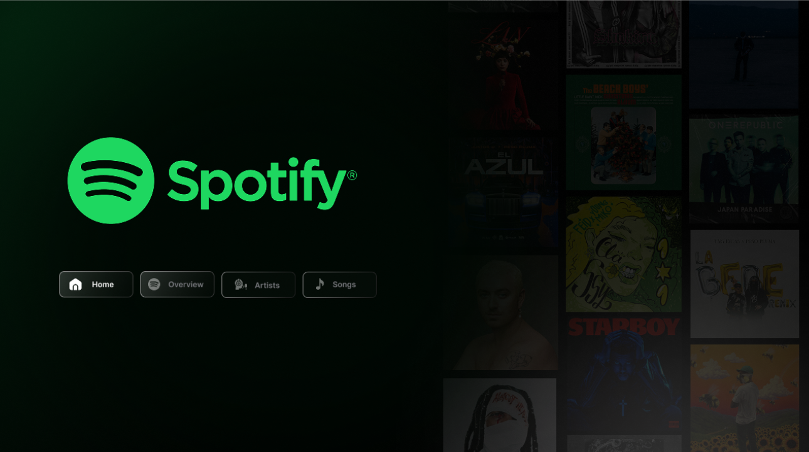
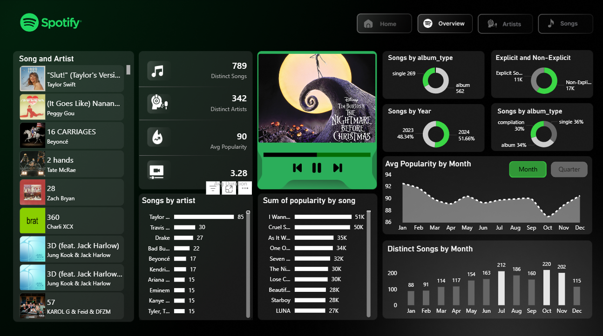
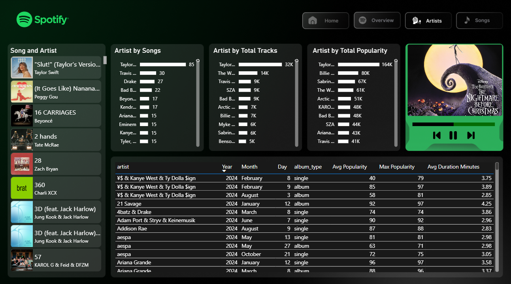
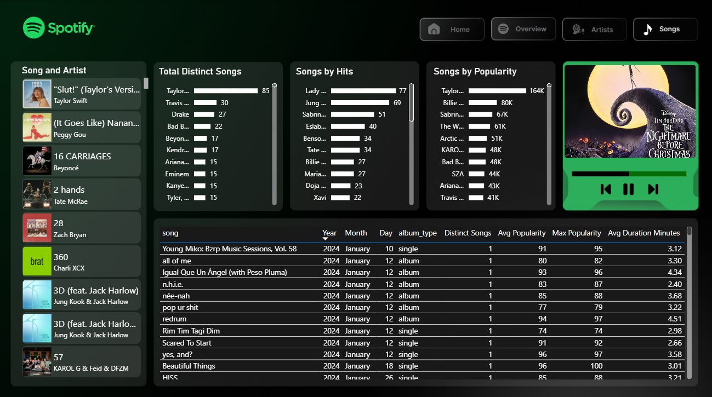

# 🎧 Spotify Excel Data Analysis Project

## 📌 Overview

This project represents my first Excel data analysis project completed as part of the DataCamp Excel course. The analysis explores a Spotify dataset to uncover trends in song popularity, artist dominance, release types, and seasonal performance patterns.

---

## 📊 Dataset Highlights

* ~789 Songs
* 342 Artists
* Average Popularity: ~90 (Top Hits level dataset)
* Release Types: Singles, Albums, Compilations
* Explicit vs Non-Explicit comparison
* Year comparison (2023 vs 2024)

---

## 🔎 Key Insights

* Strong dominance by major artists (especially Taylor Swift)
* Taylor Swift leads in both song count and overall popularity
* Performance peaks at the end of the year (Nov–Dec)
* Slight drop in engagement mid-year
* Singles are the most common release type
* 2024 slightly outperforms 2023
* Explicit tracks exceed Non-explicit tracks

---

## 💡 Recommendations

* Focus on top artists for deeper analysis and strategic decisions
* Leverage seasonality (year-end peak) in marketing campaigns
* Prioritize Singles and Explicit content
* Investigate mid-year performance drops to optimize engagement

---

## 📈 Dashboard Preview

The Excel dashboard includes:

* KPI cards (Total Songs, Total Artists, Avg Popularity)
* Artist popularity comparison
* Monthly performance trend analysis
* Release type distribution chart
* Explicit vs Non-Explicit breakdown
* Year-over-year comparison

### 📷 Dashboard Screenshot

## 🛠 Tools Used

* Microsoft Excel
* Pivot Tables
* Pivot Charts
* Data Cleaning & Preparation
* KPI Calculations

---

Special thanks to @The Developer for the helpful Power BI design content and i nominate him honestly 
* The Developer Channel: [https://www.youtube.com/@The-Developer-BI](https://www.youtube.com/@The-Developer-BI)
* The Developer Profile: [https://www.linkedin.com/in/the-developer-yt/](https://www.linkedin.com/in/the-developer-yt/)

---

## 🚀 Next Steps

This is the first step in my data analysis journey. More advanced projects and dashboards coming soon!
